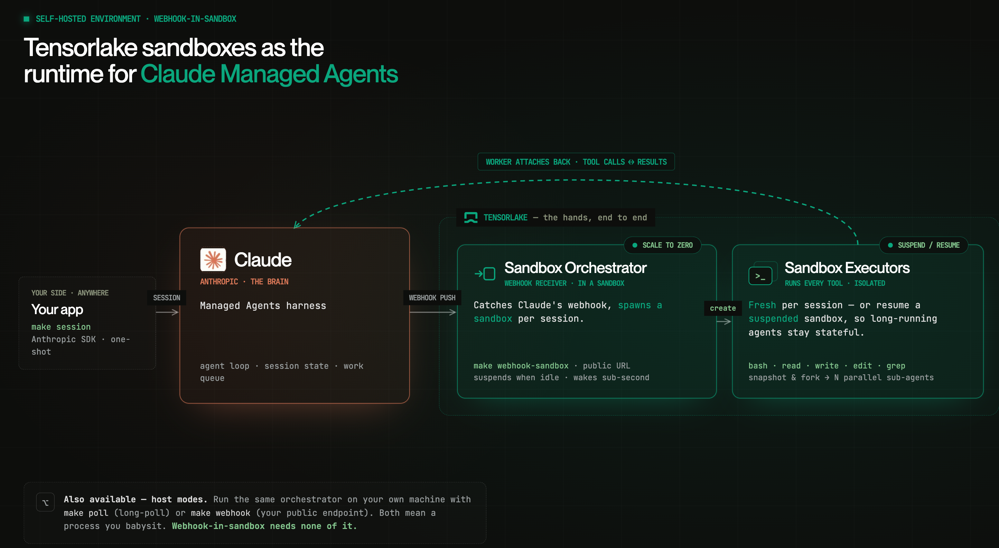
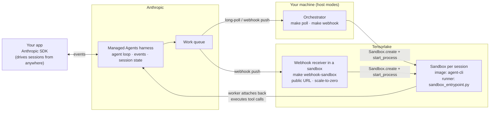
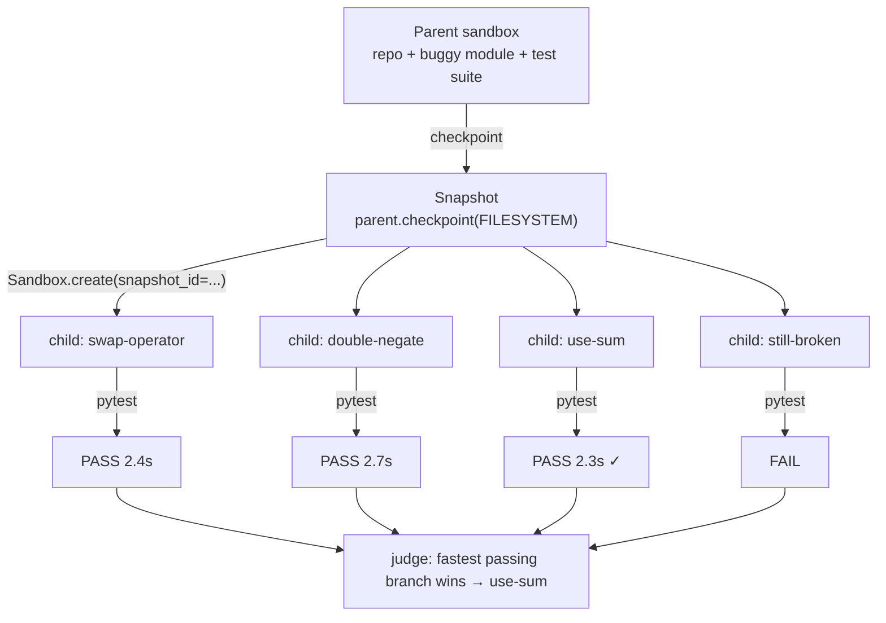
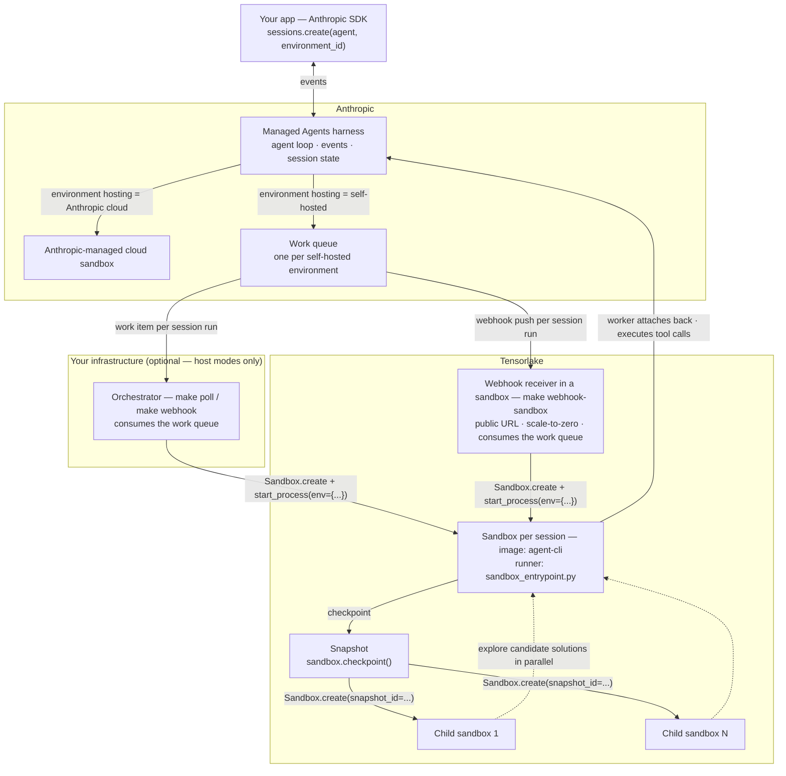

# Claude Managed Agents with Tensorlake Sandboxes

## Cookbook

### Main Ingredients

* [Claude Managed Agents](https://platform.claude.com/docs/en/managed-agents/overview)
    * Anthropic's remote agent harness that orchestrates long-running tasks and manages session state.
* [Tensorlake Sandboxes](https://docs.tensorlake.ai/sandboxes/introduction)
    * Stateful execution environments for AI agents and isolated tool calls, with snapshots, fork-from-snapshot, suspend/resume, and wake on request.

### Who runs what




The split is the whole idea: **Claude is the brain, the Tensorlake sandbox is the hands.** Claude runs the model and decides *which* tool to call; it never executes one. Every tool call actually runs inside a Tensorlake sandbox, isolated per session. In the **webhook-in-sandbox** mode below, even the orchestrator (the bit that receives Claude's webhook and spawns sandboxes) lives in Tensorlake — so nothing runs on your machine except the optional one-shot `make session` that kicks off a session.


| Runs in **Claude** | Runs in **Tensorlake** |
|---|---|
| The LLM / agent loop (reasoning) | The webhook receiver + orchestrator (webhook-in-sandbox mode) |
| Session state, events, work queue | One sandbox per session |
| Deciding *which* tool to call | *Executing* every tool call — `bash`, `read`, `write`, `edit`, `grep`, … |

### Recipes

Two examples:

* [Managed Agent](examples/managed-agent) — the reference Claude Managed Agents integration: one orchestrator that spawns a Tensorlake sandbox per session, runnable in three modes — **webhook-in-sandbox** (the receiver runs inside a Tensorlake sandbox behind a public sandbox URL — scale-to-zero push, where the sandbox suspends when idle and wakes sub-second on the next webhook), **polling**, or **webhook** (both host-run, for local dev or lowest latency)
* [Parallel Sub-Agents](examples/parallel-sub-agents) — a Tensorlake-distinctive demo that forks N sandboxes from a single snapshot so one agent session can explore N candidate solutions in parallel

#### Managed Agent — one orchestrator, three modes

Anthropic hosts the agent loop; a Tensorlake sandbox executes its tool calls. The only architectural choice is where the orchestrator (work queue → sandbox) runs: inside a Tensorlake sandbox behind a public URL (recommended — scale-to-zero push, zero infrastructure of yours), or on a host you run for local dev / lowest latency.



#### Parallel Sub-Agents — fork-from-snapshot

One known-good state, N parallel futures, keep the winner. Two SDK calls: `checkpoint()` then `Sandbox.create(snapshot_id=...)` × N.



### How Tensorlake sandbox support Claude managed agents?

Claude Managed Agents lets you keep the agent loop on Anthropic's infrastructure while running tool execution inside a sandbox you control. Tensorlake is built for exactly that role, and offers a few primitives the other launch-partner providers don't lead with:

* **Fast boot / sub-second wake.** The agent loop fires tool calls in bursts — short `bash`/`read`/`grep` calls with model think-time between them. A suspended sandbox resumes from its memory snapshot in ~0.6s (measured on 0.5.30), so the hands are ready the instant the brain decides on a tool. Low per-tool-call latency without paying to keep a sandbox warm between turns — which is what makes Tensorlake a good fit for executing the agent loop's tool calls.
* **Snapshots and fork-from-snapshot.** `sandbox.checkpoint()` captures filesystem or full memory state; then `Sandbox.create(snapshot_id=...)` boots a fresh sandbox from it. Run the same call N times and you have N children exploring in parallel from a known good state — the basis for parallel sub-agents, retry-with-divergence, and best-of-N tool execution.
* **Suspend / resume.** Named sandboxes can be suspended between bursts and resumed with state intact, so a long-lived agent session doesn't have to pay cold-start latency on every turn.
* **Configurable images, networking, and port exposure.** Custom images with the `Image(...)` builder, outbound `allow_out` / `deny_out` lists, and `client.expose_ports(...)` for previewing a server running inside the sandbox.

### The Big Picture

**Anthropic-managed cloud sandbox vs. self-hosted sandbox (Tensorlake).** The same client code drives both; the `environment_id` points at an environment whose hosting type decides where tool execution runs. A self-hosted environment puts a work item on a queue, and your orchestrator turns each item into a Tensorlake sandbox — which can then checkpoint itself and fork N children for parallel exploration.



### Code at a Glance

Define a sandbox image once:

```python
from tensorlake import Image

image = (
    Image(name="agent-cli", base_image="tensorlake/ubuntu-minimal")
    .run("apt-get update && apt-get install -y ca-certificates curl git gh python3 python3-pip")
    .run("pip install --break-system-packages 'anthropic>=0.103' 'httpx>=0.27'")
    # /opt, not /root: /root is mode 700, so the non-root runner launched via
    # start_process() can't read an entrypoint placed there.
    .copy("sandbox_entrypoint.py", "/opt/sandbox_entrypoint.py")
    .workdir("/workspace")
)
image.build(registered_name="agent-cli")
```

Spawn a sandbox per agent session:

```python
from tensorlake.sandbox import Sandbox

sandbox = Sandbox.create(
    name=session_id,
    image="agent-cli",
    cpus=2.0,
    memory_mb=4096,
    timeout_secs=3600,
)
sandbox.start_process(
    "bash",
    ["-lc", "exec python3 /opt/sandbox_entrypoint.py > /tmp/runner.log 2>&1"],
    env={
        "ANTHROPIC_ENVIRONMENT_KEY": environment_key,
        "ANTHROPIC_SESSION_ID": session_id,
        "ANTHROPIC_WORK_ID": work_id,
        "ANTHROPIC_ENVIRONMENT_ID": environment_id,
    },
)
```

Fork N children from a known checkpoint for parallel exploration:

```python
snap = sandbox.checkpoint()
children = [
    Sandbox.create(snapshot_id=snap.snapshot_id, name=f"{session_id}-explore-{i}")
    for i in range(N)
]
```

### A note on env-var injection

`Sandbox.create()` takes no `env={...}` dict — credentials and per-session values are injected per-command via `start_process(env={...})`, which merges on top of the sandbox base environment. The orchestrator holds `ANTHROPIC_ENVIRONMENT_KEY` and forwards it alongside the per-session vars (`ANTHROPIC_SESSION_ID`, `ANTHROPIC_WORK_ID`, `ANTHROPIC_ENVIRONMENT_ID`) on the same `start_process` call — no Tensorlake secret and no temp env file needed.

In the host modes the orchestrator reads that key from its own `.env`. In webhook-in-sandbox mode the receiver runs *inside* a sandbox that has no `.env`, so `launch_webhook_sandbox.py` passes `ANTHROPIC_ENVIRONMENT_KEY` and `TENSORLAKE_API_KEY` to it as process env at launch (the receiver needs the latter to create per-session sandboxes from inside its own).
