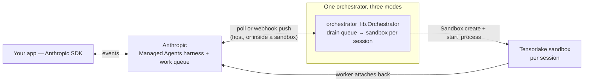

# Managed Agent (Tensorlake)

A reference integration that uses [Tensorlake Sandboxes](https://docs.tensorlake.ai/sandboxes/introduction) as the execution environment for [Claude Managed Agents](https://platform.claude.com/docs/en/managed-agents/overview). It ships the platform-integration core — image build, the in-sandbox worker, and **one orchestrator in three runnable modes** — and you drive sessions with the Anthropic SDK. The agent loop and the sandbox executions all happen remotely; you can disconnect and resume.

The orchestrator's job is always the same: consume Anthropic's work queue and get-or-create a Tensorlake sandbox per session (`src/orchestrator_lib.py`). What differs is where it runs:

| Mode | Run | Where it runs | Spawn latency | Needs |
|---|---|---|---|---|
| **Webhook-in-sandbox** (recommended) | `make build-webhook && make webhook-sandbox` | Inside a Tensorlake sandbox with its port exposed publicly | Sub-second, scale-to-zero | Nothing running anywhere of yours (wakes on request — see below) |
| **Polling** | `make poll` | Your machine / server | Seconds | A long-running host process |
| **Webhook** | `make webhook` | Your machine / server | ~Instant | A public HTTPS endpoint + TLS |



Host modes adapted from [modal-labs/claude-managed-agents-modal-sandbox/examples/cli](https://github.com/modal-labs/claude-managed-agents-modal-sandbox/tree/main/examples/cli).

## Setup

### Preparation

```bash
cd examples/managed-agent
cp .env.example .env
cp .env.local.example .env.local
```

### Tensorlake

1. Sign up at [cloud.tensorlake.ai](https://cloud.tensorlake.ai) and copy your API key. Set `TENSORLAKE_API_KEY` in `.env`.
2. Install the CLI and SDK, then login:
   ```bash
   uv sync
   uv run tl login   # or: export TENSORLAKE_API_KEY=...
   ```
3. Build the sandbox image:
   ```bash
   make build
   ```
   The environment key and per-session vars (`ANTHROPIC_SESSION_ID`, `ANTHROPIC_WORK_ID`, `ANTHROPIC_ENVIRONMENT_ID`) are injected into the runner per-command via `start_process(env={...})` — no pre-registered Tensorlake secret needed (see **Env injection** under [Notes](#notes)).

### Claude

* Create or activate a non-default workspace in [Claude Platform](https://platform.claude.com).
* Note your **Workspace ID** and set `ANTHROPIC_WORKSPACE_ID` in `.env.local` (optional; only used to make IDs clickable).
* Generate an **API key** and set `ANTHROPIC_API_KEY` in `.env.local`.
* Create an **Agent**, then set its ID in `ANTHROPIC_AGENT_ID` in `.env.local`. Either click through the console (blank template), or use the helper:
  ```bash
  make agent NAME="Managed Agent"
  ```
  It creates a Sonnet 4.6 agent with the sandbox tools (`bash`, `read`, `write`, `edit`, `glob`, `grep`) plus `web_fetch`/`web_search`, all `always_allow`, and prints the `ANTHROPIC_AGENT_ID` line to paste. Edit `src/create_agent.py` to change the model, system prompt, or tools (or pass `--model` / `--system`).
* Create an **Environment** with hosting type 'Self-hosted'. Copy its ID into `ANTHROPIC_ENVIRONMENT_ID` in `.env`.
* On the environment page, click 'Generate environment key' (Console-only, even if you created the environment via the API). Copy it into `ANTHROPIC_ENVIRONMENT_KEY` in `.env`. This key authenticates the orchestrator to the environment's work queue; your `ANTHROPIC_API_KEY` (in `.env.local`) is what creates sessions and reads queue stats.

## Pick an orchestrator mode

**Run exactly one orchestrator per `ANTHROPIC_ENVIRONMENT_ID`** — a host process *or* a webhook sandbox, never more than one.

### Webhook-in-sandbox mode (recommended — scale-to-zero push, no host process)

The FastAPI receiver runs *inside* a Tensorlake sandbox with port 5051 exposed at a public HTTPS URL — Tensorlake's proxy terminates TLS, so Anthropic can push webhooks directly to Tensorlake. Push latency with no infrastructure on your machine, and — because the sandbox **wakes on request** (see below) — nothing running and nothing billed while idle.

```bash
make build-webhook     # build the webhook-orchestrator image (receiver + tensorlake SDK baked in)
make webhook-sandbox   # get-or-create the orchestrator sandbox, expose :5051, print the URL
```

The launcher prints the public URL, which is keyed by **sandbox ID** (not name): `https://5051-<sandbox-id>.sandbox.tensorlake.ai`. Register it as a **Webhook** in Claude Platform (subscribe to `Session lifecycle → Run started` — the `session.status_run_started` event the receiver keys on) and put the signing secret in `ANTHROPIC_WEBHOOK_SIGNING_KEY` in `.env` *before* running `make webhook-sandbox` — the secret is passed into the receiver at launch.

Helpers: `make webhook-sandbox-status` (prints the current URL + status), `make webhook-sandbox-logs`, `make webhook-sandbox-rm`.

> **One credential, one project.** The image is built and the sandbox is created against whatever Tensorlake project your credentials point at. The Python SDK uses `TENSORLAKE_API_KEY`; the `tl` CLI uses your `tl login` session — if those resolve to *different* projects, `make build-webhook` registers the image in one project while `make webhook-sandbox` looks for it in another and fails with *"Image … is not registered"*. Keep both pointed at the same project.

#### Wake-on-request (verified)

The orchestrator sandbox is created with an idle timeout (`WEBHOOK_SANDBOX_TIMEOUT_SECONDS`, default 600s; set it to `60` in `.env` to see suspension quickly). When no **inbound** traffic arrives for that long, the sandbox suspends — memory and the running uvicorn process preserved. An inbound request to the exposed port then **resumes it automatically**.

Measured on tensorlake 0.5.30: a sandbox confirmed `suspended` served `GET /healthz` in **~0.6s** and flipped to `running` — a memory-snapshot restore, not a cold app boot, so uvicorn is already up on resume. Idle detection counts inbound proxied traffic only: the receiver's own outbound polling (fallback drain, janitor) does **not** keep it awake, so it still suspends on schedule.

The net result is **scale-to-zero push**: nothing running and nothing billed while idle, sub-second wake on the next webhook — instant push latency at lower idle cost than a long-running host process.

Reproduce it:

1. `make webhook-sandbox`, then `curl <url>/healthz` → `{"ok": true, ...}` (`<url>` is the ID-keyed URL the launcher prints).
2. Idle past the timeout; confirm `make webhook-sandbox-status` shows `suspended`.
3. `time curl <url>/healthz` → responds in well under a second; a follow-up status check shows `running`.

Webhooks that land during the brief wake rely on Anthropic's delivery retry; the receiver's fallback drain loop (every `WEBHOOK_DRAIN_SECONDS`) also sweeps anything missed once it's up.

Crash recovery is yours (the receiver is a process, not a durable workflow), and this one sandbox holds `TENSORLAKE_API_KEY`, the environment key, and the webhook secret together.

### Polling mode (local dev — no public URL required)

```bash
make poll
```

Long-polls Anthropic's work queue from a host process. No webhook secret needed; works behind any firewall. This is also the easiest mode to debug: logs in your terminal, ctrl-C to stop.

### Webhook mode (lowest per-event latency)

* Create a **Webhook** in Claude Platform pointed at your public HTTPS URL (Fly, Cloud Run, ngrok for dev). Subscribe only to `Session lifecycle → Run started` (the `session.status_run_started` event).
* Copy the signing secret into `ANTHROPIC_WEBHOOK_SIGNING_KEY` in `.env`.
* Run the receiver:

```bash
make webhook
```

The receiver listens on `:5051`. Put TLS in front of it.

## Drive a session

Same in every mode — from any machine, with the orchestrator running (or scheduled) elsewhere. Use the bundled driver:

```bash
make session PROMPT="create hello.txt with 'hi' then read it back"
```

It creates a session against `ANTHROPIC_ENVIRONMENT_ID`, sends the prompt, and streams the agent's work (thinking, tool calls, tool results, messages) until the session goes idle. Reuse a session for a follow-up turn with `make session SESSION=ses_... PROMPT="..."`.

Under the hood it's just the SDK (`src/drive_session.py`):

```python
import anthropic
client = anthropic.Anthropic()
session = client.beta.sessions.create(agent="agent_...", environment_id="env_...")
with client.beta.sessions.events.stream(session.id) as stream:
    client.beta.sessions.events.send(
        session.id,
        events=[{"type": "user.message", "content": [{"type": "text", "text": "ls"}]}],
    )
    for ev in stream:
        print(ev)
```

See [Events and streaming](https://platform.claude.com/docs/en/managed-agents/events-and-streaming) for the full event vocabulary.

## Files

- `src/config.py` — env loading and constants
- `src/create_agent.py` — creates a Claude Managed Agent (`make agent`)
- `src/drive_session.py` — creates a session, sends a prompt, streams the agent's work to your terminal (`make session`)
- `src/sandbox_image.py` — builds the registered Tensorlake image (`make build`)
- `src/sandbox_entrypoint.py` — runs inside each sandbox; calls `client.beta.environments.work.worker(...).handle_item()`
- `src/orchestrator_lib.py` — the shared `Orchestrator`: get-or-create-sandbox + drain-work-queue logic used by every mode
- `src/host_orchestrator_polling.py` — polling entrypoint (`make poll`)
- `src/claude_webhook_handler.py` — FastAPI webhook entrypoint, used by both webhook modes (`make webhook`, and inside the orchestrator sandbox)
- `src/webhook_sandbox_image.py` — builds the webhook-orchestrator image (`make build-webhook`)
- `src/launch_webhook_sandbox.py` — webhook-in-sandbox launcher: get-or-create the orchestrator sandbox, expose `:5051`, start the receiver (`make webhook-sandbox`)

## Verify a mode end-to-end

The test is the same in every mode: start (or schedule) exactly one orchestrator, then drive a session from anywhere and watch it stream to `done`.

```bash
# 1. start one orchestrator (pick a mode)
make poll                 # or: make webhook / make webhook-sandbox

# 2. (optional) confirm the orchestrator is reaching the work queue.
#    Uses ANTHROPIC_API_KEY from .env.local — NOT the environment key —
#    so run it from outside the orchestrator, never inside the sandbox.
uv run python -c "import sys; sys.path.insert(0,'src'); import config, os, anthropic; \
print(anthropic.Anthropic().beta.environments.work.stats(os.environ['ANTHROPIC_ENVIRONMENT_ID']))"

# 3. in another terminal, drive a session
make session PROMPT="create hello.txt with 'hi' then read it back"
```

`work.stats` returns `depth` (items waiting), `pending` (claimed/in-flight), and `workers_polling` (workers seen in the last 30s). In **polling** mode the orchestrator long-polls continuously, so `workers_polling` reads ≥1 while `make poll` runs. The **webhook** modes only poll on demand (per `session.status_run_started`), so `workers_polling` is usually 0 between events — there, drive a session and watch `depth`/`pending` rise then drain back to 0.

Success looks like a stream of `running` / `thinking` / tool calls (`→ write`, `→ read`) ending in `· done (stop_reason=...end_turn)`.

## Troubleshooting

**`RemoteAPIError (status 401) AUTH_REQUIRED` from `Sandbox.create()` (host modes).** The orchestrator couldn't authenticate to Tensorlake when spawning the per-session sandbox. The `tensorlake.sandbox` SDK snapshots `TENSORLAKE_API_KEY` into module-level defaults *at import time*, so `src/orchestrator_lib.py` deliberately imports `config` (which calls `load_env()`) **before** importing the SDK — keep that order. Then check that `TENSORLAKE_API_KEY` in `.env` is set and valid.

**Orchestrator targets the wrong Tensorlake project (sandboxes appear in a project you didn't expect).** `.env` is authoritative: `config.load_env()` loads `.env` with `override=True`, so a stale `TENSORLAKE_API_KEY` left exported in your shell no longer silently shadows `.env` (python-dotenv's default lets the shell value win, which can point the orchestrator at a different project). Verify which project a key resolves to:

```bash
uv run python -c "from tensorlake.sandbox import Sandbox; print(len(list(Sandbox.list())), 'sandboxes')"
```

If that count doesn't match the project you intend, fix the key in `.env` (it now wins over any shell export).

## Notes

- **Env injection.** `Sandbox.create()` takes no arbitrary `env={...}` dict, and the current SDK (0.5.30) no longer accepts `secret_names` either (the server rejects it). So the orchestrator passes *every* var the in-sandbox runner needs — including `ANTHROPIC_ENVIRONMENT_KEY` alongside the per-session `ANTHROPIC_SESSION_ID` / `ANTHROPIC_WORK_ID` / `ANTHROPIC_ENVIRONMENT_ID` — per-command via `start_process(env={...})`, which merges on top of the sandbox base environment. No pre-registered secret, no temp env file.
- **Idle cleanup.** Sandboxes auto-suspend via `timeout_secs` in every mode. The host modes additionally run a janitor thread for the stuck-`failed` edge case.
- **Preview URLs.** Expose a server inside the sandbox with `Sandbox.update(exposed_ports=[8080], allow_unauthenticated_access=True)` — what `launch_webhook_sandbox.py` does for `:5051` — which serves it at `https://8080-{sandbox_id}.sandbox.tensorlake.ai` (keyed by sandbox ID, not name).
- **Concurrent spin-up (sync vs async).** This example is intentionally synchronous: the receiver acks each webhook immediately and drains in the background, but a single drain holds `_drain_lock` and walks the queue in a sequential `for` loop (`orchestrator_lib.py`), so a burst of sessions has its sandboxes created **one at a time**. It never drops or double-spawns work (get-or-create is idempotent per session), it just isn't parallel. Tensorlake also ships an async API — `AsyncSandbox` / `AsyncSandboxClient` in `tensorlake.sandbox`, full method parity — which pairs with the documented async worker (`client.beta.environments.work.poller(...)`, the async-only counterpart to the sync `iter_work` used here). Switching the orchestrator to `AsyncAnthropic` + `AsyncSandbox` lets one drain create sandboxes **concurrently** via `asyncio.gather`, bounded by a semaphore for your Tensorlake concurrent-sandbox quota; the per-session idempotency lock carries over as an `asyncio.Lock`. Left out here to keep the reference path readable — reach for it when burst spin-up latency matters.
- **Where this goes next — multi-step tool calls.** This example's orchestrator is a thin, stateless dispatcher: one work item → one sandbox. A natural extension is a tool call that is really a *multi-step pipeline* — fan out N sandboxes from a single snapshot, run them in parallel, and join the results. That fan-out primitive (`checkpoint()` → `Sandbox.create(snapshot_id=...)`) is the [parallel-sub-agents](../parallel-sub-agents) example.
